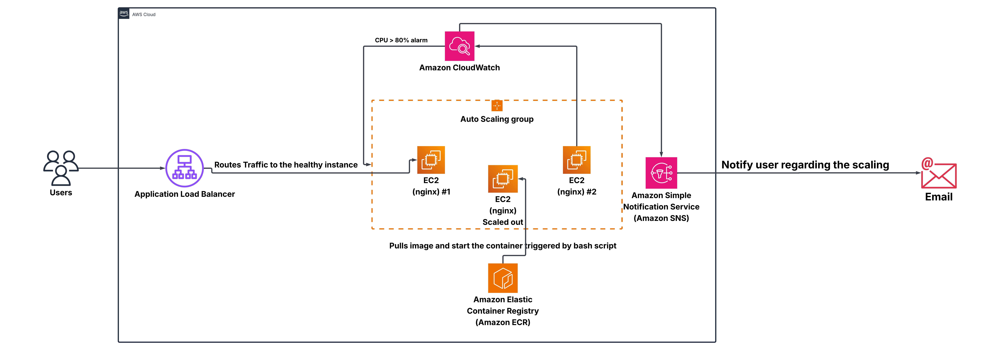

# Auto-Scaling EC2 Architecture

## Overview
* Architected a highly available, fault-tolerant web architecture utilizing Amazon EC2, Auto Scaling
Groups (ASG), and an Application Load Balancer (ALB) to dynamically manage traffic.
* Containerized an Nginx application using Docker and stored custom images in Amazon ECR; auto-
mated instance provisioning via EC2 Launch Template User Data bash scripts to pull images and start
containers without manual intervention (ECR)..
* Configured AWS CloudWatch alarms to trigger scale-out events at 80% CPU utilization and deliver
real-time SNS email alerts, implementing proactive cloud monitoring and observability
* Validated auto-scaling behavior under load using stress-ng to simulate production-level CPU stress,
confirming automated scaling triggers functioned as expected

## Architecture

## Tech Stack
- AWS EC2, Auto Scaling Groups, ALB
- Docker
- (any IaC tools you used)

## Features
- What problem this solves
- Key technical decisions you made

## Prerequisites
- AWS CLI configured
- Docker installed

## How to Run
Step by step commands to deploy this

## What I Learned
Honest reflection — interviewers love this
